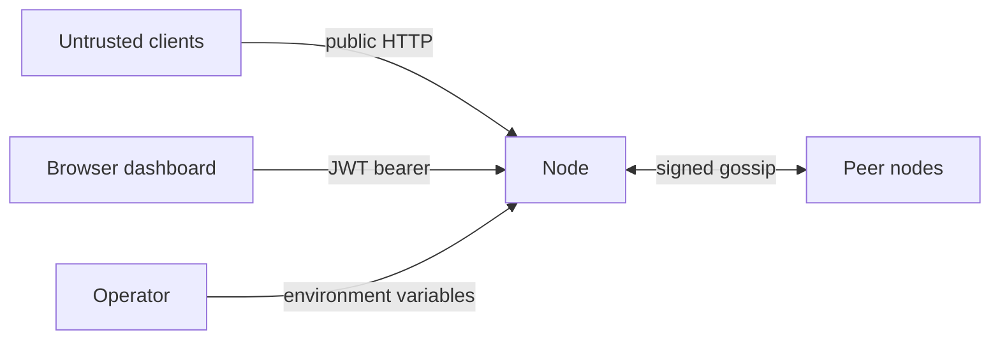

# Threat Model

This document describes what GossipGuard protects, what it does not, and the
reasoning behind each control. It reflects the code as it stands rather than an
aspirational design, so it names the gaps as plainly as the mitigations.

## System summary

Three or more FastAPI nodes each enforce per-user request limits. Every node
counts locally and periodically gossips its counts to a subset of peers, so the
cluster converges on a shared view without a central store. Counter state is held
in memory only. There is no database.

## Trust boundaries

Three boundaries matter:

1. **Internet to node.** Anyone can reach `/auth/token`, `/protected/public`,
   and the dashboard. Everything crossing here is untrusted.
2. **Node to node.** The gossip mesh. Peers are semi trusted: authenticated by a
   shared secret, but any compromised node can write to every other node's state.
3. **Operator to node.** Secrets and peer lists arrive through environment
   variables. The operator is trusted.

## Assets

| Asset | Why it matters |
|---|---|
| Rate limit counters | The product. Corrupting them  elets a clientxceed limits or locks a legitimate client out. |
| `GOSSIP_SECRET_KEY` | Holding it lets an attacker write arbitrary counter state to every node. |
| `JWT_SECRET_KEY` | Holding it lets an attacker mint tokens for any user, including admins. |
| Password hashes | In memory only, but recovery would expose credentials reused elsewhere. |
| Counter snapshots | Contain client IPs and user IDs. Exposure is a privacy concern, not a compromise. |

## Attack surface

| Endpoint | Authentication | Rate limited |
|---|---|---|
| `POST /auth/token` | None | Yes, anonymous tier |
| `GET /auth/me` | JWT | Yes |
| `GET /protected/public` | None | Yes, anonymous tier |
| `GET /protected/profile` | JWT plus `READ_PROFILE` | Yes |
| `GET /protected/admin` | JWT plus `MANAGE_USERS` | Yes |
| `GET /internal/gossip/state` | JWT plus `VIEW_AUDIT_LOGS` | No |
| `GET /internal/gossip/debug` | JWT plus `VIEW_AUDIT_LOGS` | No |
| `POST /internal/gossip/sync` | HMAC signature plus source IP allowlist | No |
| `GET /`, `/dashboard`, `/static/*` | None | Yes for the routes, static files bypass |

Paths under `/internal/` are exempt from rate limiting by design
(`app/middleware/rate_limit_middleware.py:17`). Throttling gossip would let a
traffic spike starve the very messages needed to converge, turning a load event
into a partition.

## Threats

### T1. Forged gossip messages

An attacker who can POST to `/internal/gossip/sync` writes directly into counter
state. Raising a victim's count denies them service. Supplying a fresher
`updated_at` with a low count resets their usage and defeats the limit entirely,
because the merge takes the newer timestamp as authoritative
(`app/repositories/rate_limit_repository.py:74`).

**Controls.** HMAC-SHA256 over a canonical, key sorted JSON body, compared with
`hmac.compare_digest` so verification does not leak position through timing
(`app/core/signing.py`). Independently, the source address must resolve from a
configured peer URL (`app/api/routes/internal.py:112`). Both must pass.

**Residual risk.** One shared secret covers the whole cluster. Any compromised
node, or any leak of the environment variable, grants full write access to every
node's state. There is no per peer key and no rotation path.

### T2. Replay of captured gossip

An attacker positioned on the network can capture a signed envelope and resend
it. The signature still verifies, because nothing about the message changed.

**Controls.** Three layers, in the order the route applies them.

The merge rule defeats most replays on its own. A slot is only overwritten when
the incoming `updated_at` is strictly newer, or equal with a higher count, so a
stale envelope loses to current state and changes nothing. This falls out of the
CRDT design rather than being a deliberate control, but it is the reason replay
was never critical here.

Freshness is checked explicitly against `GOSSIP_MAX_SKEW_SECONDS`, sixty seconds
by default (`app/core/replay_guard.py`). This replaced a hardcoded one hour
tolerance, which was far too wide for a protocol that gossips every half second,
and which also reported the server's clock offset in its error message.

Every accepted signature is then remembered for exactly the freshness window
(`ReplayGuard`). A second copy of the same envelope is refused outright. Entries
expire with the window, since anything older is already rejected on freshness, so
the cache is bounded by the number of envelopes genuinely received in sixty
seconds rather than growing without limit.

Order matters: the signature is verified before the cache is consulted, so an
unauthenticated attacker cannot fill it with junk entries.

**Residual risk.** Correctness now depends on clock synchronisation between
peers. Nodes whose clocks drift more than sixty seconds apart will refuse each
other's gossip, which is an availability failure rather than a security one, but
it is a new operational requirement. Tightening the window further without NTP
in place will cause false rejections.

### T3. Rate limit evasion across nodes

Between gossip rounds a node knows only its own count plus the last snapshot it
received. A client spreading requests across all nodes is admitted by each of
them before any of them learn about the others.

**Control.** Gossip at 0.5 second intervals with randomised fanout bounds how
long the divergence lasts.

**Residual risk.** This is the headline limitation of the design. Worst case
admission approaches the configured limit multiplied by the node count during the
convergence window. The standard fix, not yet implemented, is for each node to
reserve `limit / node_count` locally and gossip to reclaim unused headroom.
Choosing eventual consistency over a central store is what buys the availability
and the absent network hop, and this is the price.

### T4. Credential attacks

**Controls.** bcrypt at cost factor 12 (`app/core/auth.py:13`) makes offline
cracking expensive. Login errors are identical for an unknown username and a wrong
password. `/auth/token` is rate limited at the anonymous tier, ten attempts per
minute per IP by default.

**Residual risk.** Two real gaps. First, a username enumeration oracle:
`authenticate_user` short circuits when the user does not exist
(`app/services/auth_service.py:16`), so bcrypt never runs and the response returns
measurably faster than for a valid username. Second, the throttle is keyed on
client IP, so a distributed attempt across many source addresses is not slowed.
There is no account lockout and no failed attempt logging.

### T5. Token handling

**Controls.** The decode call pins the algorithm list
(`app/core/auth.py:35`), which blocks the `alg: none` and algorithm confusion
family. Tokens expire after thirty minutes by default.

**Residual risk.** There is no `jti` and no revocation list, so a stolen token
stays valid until it expires. Logging out clears the browser copy and nothing
server side. The dashboard keeps its token in `localStorage`
(`frontend/app.js:37`), which any successful script injection can read.

### T6. Injection in the dashboard

`renderPeers` interpolates peer URLs into `innerHTML` without escaping
(`frontend/app.js:63`). Peer URLs originate from operator controlled
configuration, not user input, so this is not currently exploitable.

**Residual risk.** The pattern is one configuration change away from being live.
If peers ever become settable through the API or by a non administrator, this
becomes stored XSS against every admin viewing the dashboard. Snapshot data is
rendered with `textContent` and is safe.

### T7. Resource exhaustion

Counter keys are derived from the client IP, optionally suffixed with a user ID
(`app/middleware/rate_limit_middleware.py:24`). An attacker rotating source
addresses creates a new map entry per address.

**Controls.** Every slot carries an expiry, pruning runs on each access, and a
janitor sweeps every sixty seconds (`app/services/gossip_service.py:79`). Memory
is therefore bounded by unique keys seen within one window rather than growing
without limit.

**Residual risk.** Within a window that bound can still be large. More
importantly, the full snapshot is serialised and sent to each chosen peer every
interval, so gossip bandwidth grows linearly with tracked keys and a key flooding
attack degrades the whole mesh, not just one node. `POST /internal/gossip/sync`
also has no body size limit, so a signed but oversized snapshot from a compromised
peer can exhaust memory during parsing.

### T8. Transport exposure

Gossip runs over plain HTTP. The signature protects integrity and authenticity
but not confidentiality, so snapshots containing client IPs and user IDs travel in
cleartext, and a network observer can map traffic patterns per user.

**Requirement.** Deploy the gossip mesh on a private network, or terminate TLS
between peers. The application does not enforce this.

### T9. Proxy deployment breaks client identity

The rate limiter reads `request.client.host` directly and ignores
`X-Forwarded-For` (`app/middleware/rate_limit_middleware.py:20`). Behind a load
balancer or reverse proxy every request appears to come from the proxy.

**Impact.** Anonymous clients collapse into a single shared bucket, so one noisy
client throttles everyone, and authenticated clients are keyed on a constant
prefix. Any real deployment needs a trusted proxy header configuration before this
control means anything.

### T10. Stale peer address cache

`_resolve_peer_ips` is memoised with `lru_cache` and never expires
(`app/api/routes/internal.py:84`). A peer whose address changes is refused until
the process restarts. If resolution happens once while DNS is compromised, the
attacker's address is trusted for the lifetime of the process. This is primarily
an availability problem, since the signature check still has to pass.

## Deliberate design choices

These look like defects and are not.

- **Throttled requests still increment the counter.** `allow_request` records the
  hit before comparing it against the limit
  (`app/services/rate_limit_service.py:25`), so a client that keeps hammering after
  a 429 extends its own lockout. This is a penalty, not an accounting error.
- **`/internal/` bypasses rate limiting.** Explained above under attack surface.
- **Secrets have no defaults.** `Settings` raises at construction when either key
  is missing (`app/core/config.py:64`), so the process refuses to start rather
  than silently running with a guessable secret. Demo accounts are disabled unless
  explicitly enabled, and require passwords supplied from the environment.

## Out of scope

Host and container hardening, supply chain integrity of dependencies, denial of
service at the network layer, physical access, and insider threat from the
operator. Persistence is also out of scope because there is none: all state is in
memory and a restart clears every counter, which is itself a limit evasion vector
if nodes restart frequently.

## Summary of known gaps

| Gap | Severity | Status |
|---|---|---|
| Over admission during convergence | Medium | Known, fix identified, not implemented |
| Single shared gossip secret, no rotation | Medium | Accepted for current scope |
| Peer clocks must stay within the skew window | Low | New operational requirement |
| No `X-Forwarded-For` handling | Medium | Blocks correct proxy deployment |
| Username enumeration by response timing | Low | Not addressed |
| No token revocation | Low | Accepted, mitigated by short expiry |
| Token in `localStorage` | Low | Accepted for a demo dashboard |
| Unescaped peer URLs in the dashboard | Low | Latent, not currently reachable |
| No request size limit on gossip sync | Low | Not addressed |
| Peer address cache never expires | Low | Not addressed |

